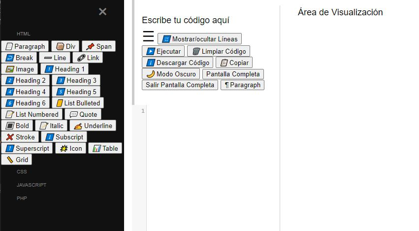

# Editor de Código Interactivo con CodeMirror

## Acceso Rápido a la Aplicación
[Editor de Código Interactivo con CodeMirror](https://xococode.github.io/EditorHTMLv1.github.io/)

## Descripción

Este proyecto es un editor de código interactivo basado en **CodeMirror** que permite a los usuarios escribir, ejecutar, visualizar y gestionar su código HTML de manera eficiente. La interfaz intuitiva divide la pantalla en dos secciones principales: el editor de código y el área de visualización previa. Además, incluye funcionalidades adicionales como modo oscuro, copiar al portapapeles, descargar código, pantalla completa y más.

## Características

- **Editor de Código Integrado**: Utiliza CodeMirror para una experiencia de edición enriquecida con resaltado de sintaxis, numeración de líneas y envoltura de línea.
- **Área de Visualización Previa**: Muestra una vista previa en tiempo real del código HTML ingresado.
- **Botones de Acción**:
  - **Ejecutar**: Actualiza la vista previa con el código actual.
  - **Limpiar Código**: Borra el contenido del editor.
  - **Descargar Código**: Descarga el código HTML como un archivo `.html`.
  - **Copiar**: Copia el contenido del editor al portapapeles.
  - **Modo Oscuro**: Alterna entre modo claro y oscuro para una mejor experiencia visual.
  - **Pantalla Completa**: Permite entrar y salir de la vista de pantalla completa.
- **Redimensionamiento Dinámico**: Permite ajustar el tamaño del editor y la vista previa arrastrando el divisor central.
- **Compatibilidad Responsiva**: Se adapta a diferentes tamaños de pantalla para una experiencia óptima en dispositivos móviles y de escritorio.
- **Sidebar Desplegable**: Un sidebar fijo para acciones como agregar, guardar y cargar fragmentos de código, así como inserción de elementos HTML.

## Descargo de Responsabilidad

**Importante:** El uso de este código es bajo total responsabilidad del usuario. ** Xocostudio** no se hace responsable por ningún tipo de mal uso, daño directo o indirecto, pérdida de datos, o cualquier otro perjuicio que pueda derivarse del uso de este software.

### Sin Garantías

El software se proporciona "tal cual", sin garantías de ningún tipo, ya sean expresas o implícitas. Esto incluye, pero no se limita a, las garantías de comerciabilidad, adecuación para un propósito particular y no infracción.

### Exención de Responsabilidad

Los autores no son responsables por cualquier reclamación, daño u otra responsabilidad que surja del uso del software, ya sea en una acción de contrato, agravio o de otra manera, que surja de, fuera de o en conexión con el software o el uso u otros tratos en el software.

### Uso del Código

Al descargar y utilizar este código, aceptas hacerlo bajo tu propio riesgo. Es tu responsabilidad asegurarte de que el software es adecuado para tus necesidades y de tomar todas las precauciones necesarias para evitar posibles daños o pérdidas.

Si tienes alguna pregunta o necesitas más información, por favor contacta a Xocostudio.

---

*¡Gracias por utilizar nuestro software! Asegúrate de leer y entender este descargo de responsabilidad antes de proceder.*

## Descargo de Responsabilidad

**Importante:** El uso de este código es bajo total responsabilidad del usuario. ** Xocostudio** no se hace responsable por ningún tipo de mal uso, daño directo o indirecto, pérdida de datos, o cualquier otro perjuicio que pueda derivarse del uso de este software.

### Sin Garantías

El software se proporciona "tal cual", sin garantías de ningún tipo, ya sean expresas o implícitas. Esto incluye, pero no se limita a, las garantías de comerciabilidad, adecuación para un propósito particular y no infracción.

### Exención de Responsabilidad

Los autores no son responsables por cualquier reclamación, daño u otra responsabilidad que surja del uso del software, ya sea en una acción de contrato, agravio o de otra manera, que surja de, fuera de o en conexión con el software o el uso u otros tratos en el software.

### Uso del Código

Al descargar y utilizar este código, aceptas hacerlo bajo tu propio riesgo. Es tu responsabilidad asegurarte de que el software es adecuado para tus necesidades y de tomar todas las precauciones necesarias para evitar posibles daños o pérdidas.

Si tienes alguna pregunta o necesitas más información, por favor contacta a Xocostudio.

---

*¡Gracias por utilizar nuestro software! Asegúrate de leer y entender este descargo de responsabilidad antes de proceder.*

